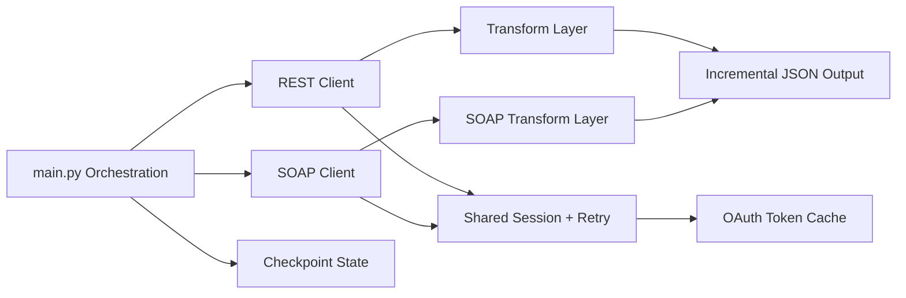

# SFMC Data Pipeline

Production-grade extraction pipeline for Salesforce Marketing Cloud (SFMC) data migration, with protocol-specific ingestion, resumable execution, and incremental persistence.

## Executive Summary

This repository implements a dual-protocol ETL runtime:

- **REST pipeline** for Content Builder assets and HTML payloads
- **SOAP pipeline** for send-level tracking and engagement telemetry

The platform is designed for migration windows where reliability is mandatory: interrupted runs can resume from checkpoints, token/session lifecycle is managed centrally, and outputs are persisted incrementally to avoid full-run data loss.

## Business Problem

SFMC decommissioning, tenant migration, and compliance export scenarios require complete historical extraction from APIs that differ in protocol, pagination model, and response shape. Manual export approaches are slow, inconsistent, and operationally fragile.

This pipeline solves that by providing:

- deterministic extraction flow for REST and SOAP endpoints
- protocol-aware continuation semantics
- restart-safe execution without reprocessing from page 1

## Architecture Overview



### Engineering Highlights

| Area | Implementation | Outcome |
|---|---|---|
| Protocol isolation | `clients/sfmc_client.py` and `clients/sfmc_soap_client.py` | Clear separation of REST and SOAP behavior |
| Stateful recovery | `state/checkpoint.py` + per-pipeline state files | Resume after interruption with minimal replay |
| Token lifecycle | in-memory + `state/token_cache.json` | Reduced authentication churn |
| Retry behavior | `requests.Session` + `urllib3.Retry` | Better resilience to 429/5xx transient errors |
| Schema control | `config/sfmc_columns.py` | Centralized field governance |

## Pipeline Flow

1. Load environment and credentials.
2. Initialize shared HTTP session and token state.
3. Load protocol-specific checkpoint.
4. Extract batch/page from SFMC API.
5. Transform and normalize records.
6. Append to output JSON file.
7. Persist checkpoint.
8. Continue until source signals completion.
9. Clear checkpoint on successful completion.

## REST Pipeline

**Purpose:** Extract Content Builder assets.

- Endpoint: `asset/v1/content/assets/query`
- Pagination: page + pageSize
- Continuation signal: `len(items) == pageSize`
- Checkpoint file: `state/rest_checkpoint.json`
- Output file: `output/sfmc_html.json`

**Key fields:**

- `id`, `name`
- `views.subjectline.content`
- `views.preheader.content`
- `views.html.content`
- `views.html.slots`

## SOAP Pipeline

**Purpose:** Extract send tracking and delivery metrics.

- Endpoint: `Service.asmx`
- Continuation model: `RequestID` / `ContinueRequest`
- Completion signal: `OverallStatus != MoreDataAvailable`
- Checkpoint file: `state/soap_checkpoint.json`
- Output file: `output/sfmc_soap.json`

**Key fields:**

- `ID`, `EmailName`, `Subject`, `Status`
- `SendDate`, `SentDate`
- `NumberSent`, `NumberDelivered`
- `UniqueOpens`, `UniqueClicks`
- `HardBounces`, `SoftBounces`, `Unsubscribes`

## Checkpoint Recovery

Checkpoint state is updated after each successful write:

- REST: next page + last processed id
- SOAP: latest `request_id`

This design prevents full restart after interruption and supports controlled replay from the last durable commit point.

## Scalability Considerations

- Current mode is single-process, network-bound extraction.
- Memory growth is currently tied to in-memory list accumulation before file rewrite.
- Retry policy is centralized for both pipelines, enabling consistent behavior under load.
- Future scaling should prioritize partitioned extraction and streaming writes.

## Performance Optimization

- Shared persistent HTTP session reduces connection setup overhead.
- Backoff retries reduce failures due to temporary API instability.
- Token reuse avoids repeated auth round trips.
- Incremental writes reduce risk exposure on long-running jobs.

## Security

- Credentials sourced from environment variables (`python-dotenv`).
- OAuth token obtained with client credentials flow.
- No credentials hardcoded in source.
- Token cache persisted in `state/` for operational reuse; secure filesystem permissions are required in production.

## Project Structure

```text
sfmc-data-pipeline/
├─ main.py
├─ requirements.txt
├─ clients/
│  ├─ sfmc_client.py
│  └─ sfmc_soap_client.py
├─ config/
│  ├─ settings.py
│  └─ sfmc_columns.py
├─ transform/
│  ├─ extract.py
│  └─ soap_extract.py
├─ state/
│  └─ checkpoint.py
├─ output/
├─ docs/
└─ diagrams/
```

## Installation

```bash
python -m venv .venv
.venv\Scripts\activate
pip install -r requirements.txt
```

## Environment Setup

Create `.env` in repository root:

```env
SFMC_CLIENT_ID=your_client_id
SFMC_CLIENT_SECRET=your_client_secret
SFMC_SUBDOMAIN=your_subdomain
PAGE_SIZE=100
```

## Usage Examples

Run REST pipeline (current default entrypoint):

```bash
python main.py
```

Run SOAP pipeline from Python shell or by changing entrypoint:

```python
from main import run_fetch_soap_data
run_fetch_soap_data()
```

## Output Examples

REST sample (`output/sfmc_html.json`):

```json
{
  "id": 12345,
  "name": "Welcome_Email",
  "views.html.content": "<html>...</html>",
  "views.html.slots": {}
}
```

SOAP sample (`output/sfmc_soap.json`):

```json
{
  "ID": "987654",
  "EmailName": "Weekly_Newsletter",
  "Status": "Sent",
  "NumberSent": "10230",
  "UniqueOpens": "3145"
}
```

## Roadmap

- orchestration with Airflow/Dagster
- async and partitioned extraction
- distributed checkpoint backend
- cloud-native storage and warehouse sinks
- observability with metrics, traces, and alerting
- CI/CD hardening and containerized deployment

## Documentation

- [Architecture](docs/architecture.md)
- [Checkpoint System](docs/checkpoint-system.md)
- [Recovery System](docs/recovery-system.md)
- [API Flow](docs/api-flow.md)
- [Performance](docs/performance.md)
- [Scalability](docs/scalability.md)
- [Engineering Decisions](docs/engineering-decisions.md)
- [Roadmap](docs/roadmap.md)
- [Diagrams](diagrams/README.md)
