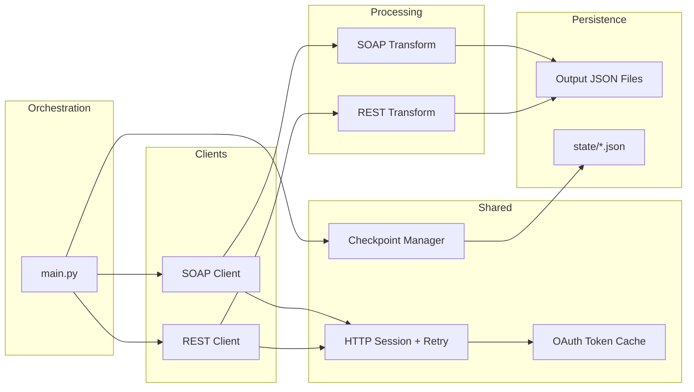

# Architecture Flow

```mermaid
flowchart LR
    subgraph Orchestration
      M[main.py]
    end

    subgraph Clients
      R[REST Client]
      S[SOAP Client]
    end

    subgraph Shared
      T[OAuth Token Cache]
      H[HTTP Session + Retry]
      C[Checkpoint Manager]
    end

    subgraph Processing
      TR[REST Transform]
      TS[SOAP Transform]
    end

    subgraph Persistence
      O[Output JSON Files]
      ST[state/*.json]
    end

    M --> R
    M --> S
    R --> H
    S --> H
    H --> T
    R --> TR
    S --> TS
    TR --> O
    TS --> O
    M --> C
    C --> ST
```
