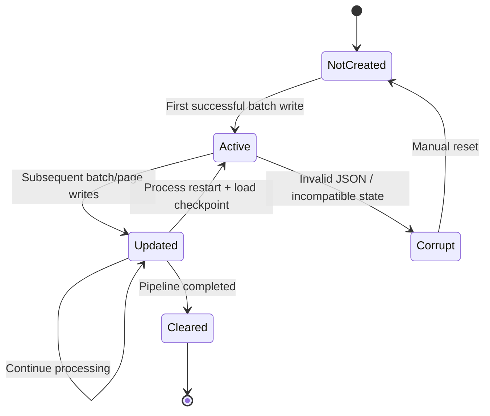

# Checkpoint Lifecycle

```mermaid
stateDiagram-v2
    [*] --> NotCreated
    NotCreated --> Active: First successful batch write
    Active --> Updated: Subsequent batch/page writes
    Updated --> Updated: Continue processing
    Updated --> Cleared: Pipeline completed
    Cleared --> [*]

    Updated --> Active: Process restart + load checkpoint
    Active --> Corrupt: Invalid JSON / incompatible state
    Corrupt --> NotCreated: Manual reset
```
