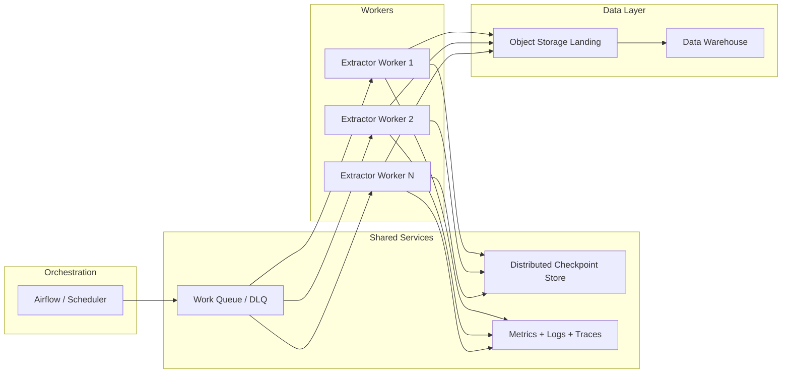

# Future Scalable Architecture

```mermaid
flowchart LR
    subgraph Orchestration
      AF[Airflow / Scheduler]
    end

    subgraph Workers
      W1[Extractor Worker 1]
      W2[Extractor Worker 2]
      WN[Extractor Worker N]
    end

    subgraph Shared Services
      CP[Distributed Checkpoint Store]
      MQ[Work Queue / DLQ]
      OBS[Metrics + Logs + Traces]
    end

    subgraph Data Layer
      OBJ[Object Storage Landing]
      WH[Data Warehouse]
    end

    AF --> MQ
    MQ --> W1
    MQ --> W2
    MQ --> WN

    W1 --> CP
    W2 --> CP
    WN --> CP

    W1 --> OBJ
    W2 --> OBJ
    WN --> OBJ

    OBJ --> WH
    W1 --> OBS
    W2 --> OBS
    WN --> OBS
```
