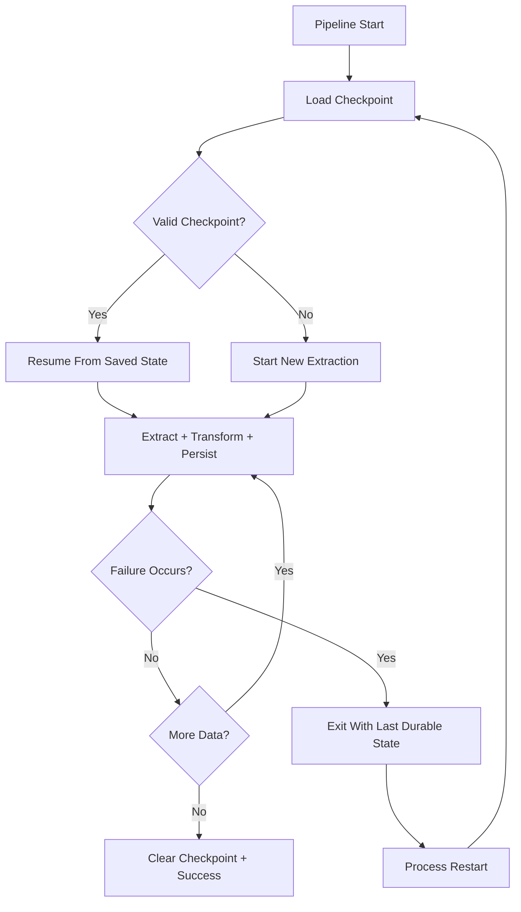

# Recovery Flow

```mermaid
flowchart TD
    A[Pipeline Start] --> B[Load Checkpoint]
    B --> C{Valid Checkpoint?}
    C -->|Yes| D[Resume From Saved State]
    C -->|No| E[Start New Extraction]
    D --> F[Extract + Transform + Persist]
    E --> F
    F --> G{Failure Occurs?}
    G -->|No| H{More Data?}
    H -->|Yes| F
    H -->|No| I[Clear Checkpoint + Success]
    G -->|Yes| J[Exit With Last Durable State]
    J --> K[Process Restart]
    K --> B
```
