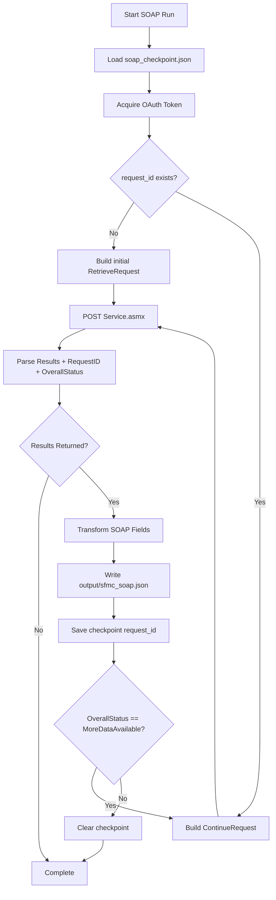

# SOAP Pipeline

```mermaid
flowchart TD
    A[Start SOAP Run] --> B[Load soap_checkpoint.json]
    B --> C[Acquire OAuth Token]
    C --> D{request_id exists?}
    D -->|No| E[Build initial RetrieveRequest]
    D -->|Yes| F[Build ContinueRequest]
    E --> G[POST Service.asmx]
    F --> G
    G --> H[Parse Results + RequestID + OverallStatus]
    H --> I{Results Returned?}
    I -->|No| N[Complete]
    I -->|Yes| J[Transform SOAP Fields]
    J --> K[Write output/sfmc_soap.json]
    K --> L[Save checkpoint request_id]
    L --> M{OverallStatus == MoreDataAvailable?}
    M -->|Yes| F
    M -->|No| O[Clear checkpoint]
    O --> N
```
