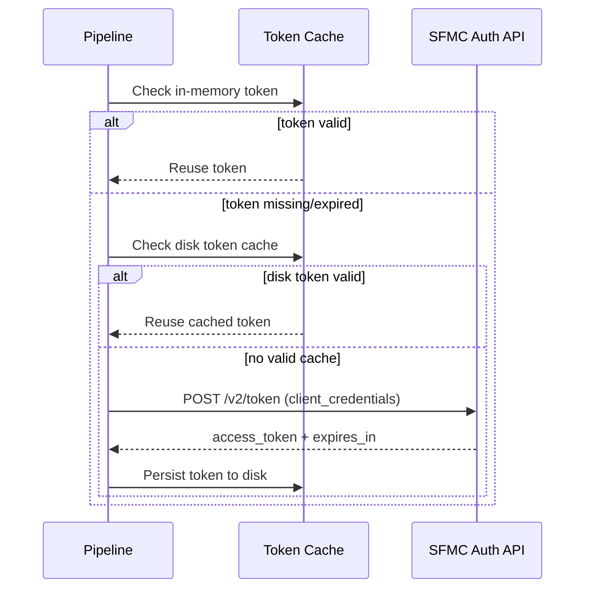
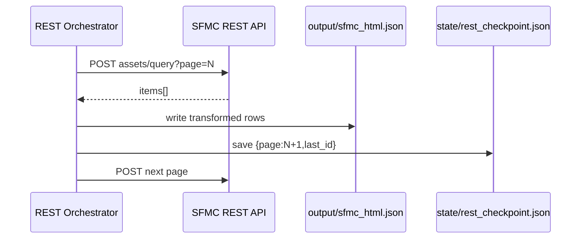
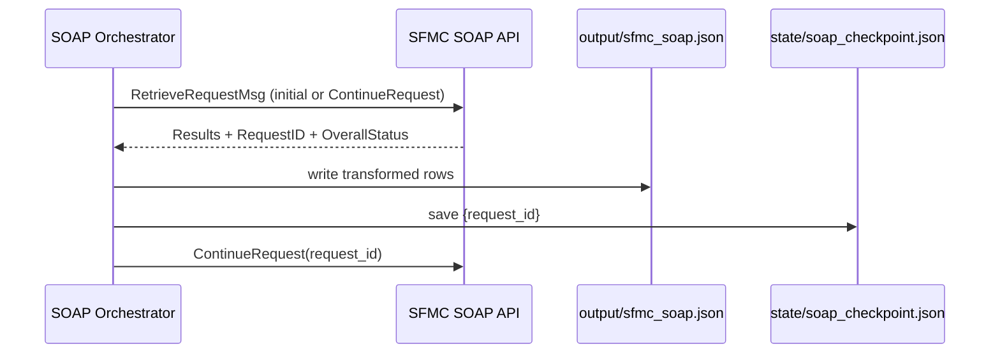

# API Flow

## End-to-End API Lifecycle

The platform executes two independent API lifecycles under one runtime:

- REST asset extraction lifecycle
- SOAP send-tracking extraction lifecycle

Both rely on shared OAuth token acquisition and shared HTTP session behavior.

## OAuth Flow

## REST Extraction Flow

### Request/Response Lifecycle

1. Build request payload with page/pageSize and sort by `id`.
2. `POST /asset/v1/content/assets/query`.
3. Receive JSON response with `items`.
4. Transform selected nested fields.
5. Persist rows to output artifact.
6. Save checkpoint with next page and last id.
7. Continue while full page returned.

### Pagination Lifecycle

- Continuation key: **page number**
- Completion condition: **returned item count < pageSize**
- Resume point: **checkpoint page**

## SOAP Extraction Flow

### Request/Response Lifecycle

1. Build SOAP XML envelope with OAuth token in header.
2. Initial request uses object type + properties + batch size.
3. Response parsed for `Results`, `RequestID`, `OverallStatus`.
4. Normalize rows and persist output.
5. Save checkpoint with `request_id`.
6. Continue with `<ContinueRequest>` while status indicates more data.

### ContinueRequest Lifecycle

- Continuation key: **RequestID**
- Next call payload includes `<ContinueRequest>{request_id}</ContinueRequest>`
- Completion condition: `OverallStatus != MoreDataAvailable`
- Resume point: checkpointed request id

## Step-by-Step Operational Flow

1. Load settings and credentials.
2. Acquire token (cache-first).
3. Load pipeline-specific checkpoint.
4. Issue protocol-specific API request.
5. Parse and transform response.
6. Persist output and checkpoint.
7. Loop until completion signal.
8. Clear checkpoint and finish.
