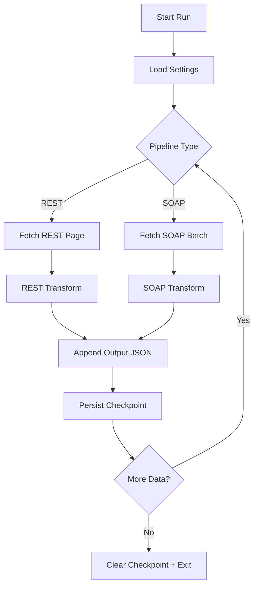
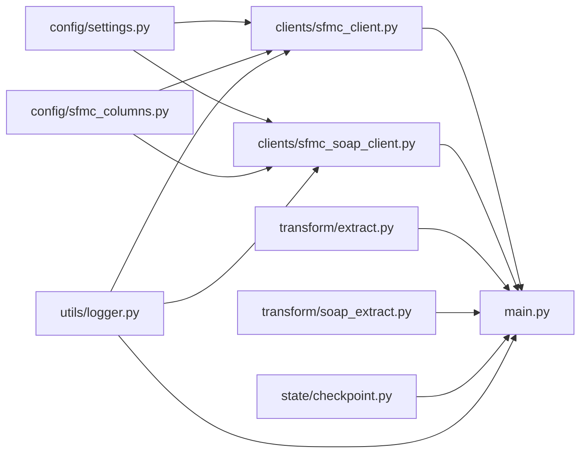

# Architecture

## System Overview

The pipeline is a single-runtime ETL service that extracts SFMC data via two independent protocol paths:

- **REST path** for Content Builder assets
- **SOAP path** for send tracking objects

Both paths share transport, token, configuration, logging, and state patterns, while keeping extraction semantics isolated.

## Component Responsibilities

| Component | Responsibility | Notes |
|---|---|---|
| `main.py` | Orchestration and run lifecycle | Manages startup, loops, persistence, summaries |
| `clients/sfmc_client.py` | REST auth/session/retry + REST extraction | Handles token cache, REST paging |
| `clients/sfmc_soap_client.py` | SOAP envelope build/parse + continuation | Handles `ContinueRequest` lifecycle |
| `transform/extract.py` | REST record projection and normalization | Nested field extraction and string cleanup |
| `transform/soap_extract.py` | SOAP row normalization | Null/blank cleanup |
| `config/settings.py` | Environment-driven runtime settings | Credentials and page size |
| `config/sfmc_columns.py` | Central schema mapping | Field contracts for extractors |
| `state/checkpoint.py` | Durable checkpoint persistence | Save/load/clear per pipeline |
| `utils/logger.py` | Shared structured logging format | Consistent runtime logs |

## Data Flow

## Protocol Separation

REST and SOAP are separated because they differ in:

- transport payload format (JSON vs XML envelope)
- continuation semantics (page number vs request token)
- parsing model (JSON object traversal vs XML namespace parsing)
- response termination signals

This avoids brittle abstractions and keeps each client aligned with protocol constraints.

## ETL Lifecycle

1. **Initialize** runtime settings, logger, token/session.
2. **Load** checkpoint for selected pipeline.
3. **Extract** one API unit (page or batch).
4. **Transform** raw payload into normalized row shape.
5. **Persist** cumulative output artifact.
6. **Checkpoint** continuation state.
7. **Repeat** until source completion.
8. **Finalize** by clearing checkpoint and emitting run summary.

## Dependency Flow

## Orchestration Logic

- `run_fetch_rest_data()` runs a page loop with `next_page` progression.
- `run_fetch_soap_data()` runs a continuation loop using `request_id`.
- Both loops checkpoint after durable write and clear state only on clean completion.

## Auth and Token Lifecycle

Token handling in `sfmc_client.py` follows three-tier retrieval:

1. in-memory token (fast path)
2. disk token cache (`state/token_cache.json`)
3. fresh OAuth request to SFMC auth endpoint

This minimizes authentication load and allows token reuse across process restarts.

## Extraction Lifecycle

### REST

- Build page query payload
- Submit request through retry-enabled session
- Parse `items`
- Determine completion via page-size boundary

### SOAP

- Build initial retrieve envelope or continuation envelope
- Submit request through shared session
- Parse `OverallStatus`, `RequestID`, `Results`
- Continue while `MoreDataAvailable`

## Architecture Reasoning

- Protocol-specific clients maximize correctness and maintainability.
- Shared transport/auth avoids duplicated reliability logic.
- Checkpoint durability protects long-running exports.
- Transform isolation enables deterministic schema projection.

## Scalability Implications

- Current architecture is robust for single-worker execution.
- Scaling to higher volumes will require:
  - partitioned workload execution
  - streaming writes to avoid full in-memory accumulation
  - externalized distributed checkpoint coordination
