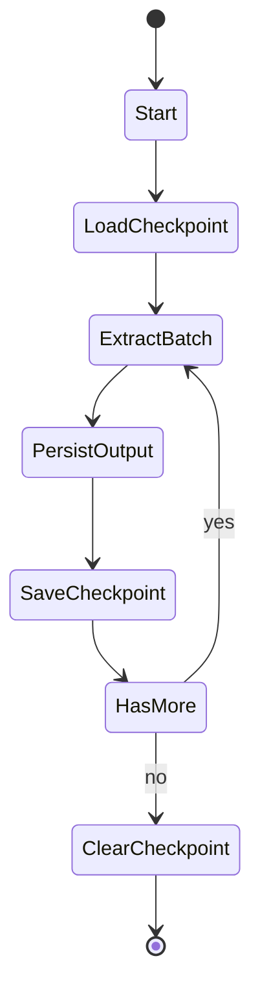

# Checkpoint System

## Purpose

Checkpointing provides durable extraction state so interrupted runs resume from the last committed progress point instead of restarting from scratch.

It solves three reliability problems:

1. **Long-running job interruption** (network/process/env failure)
2. **Duplicate reprocessing risk** after restart
3. **Operational uncertainty** about where to continue

## Checkpoint Files

| Pipeline | File | State Model |
|---|---|---|
| REST | `state/rest_checkpoint.json` | `page`, `last_id` |
| SOAP | `state/soap_checkpoint.json` | `request_id` |

Checkpoint utilities are implemented in `state/checkpoint.py`.

## Lifecycle



## REST Checkpoint Semantics

- At startup, loader reads last saved `page` and `last_id`.
- Pipeline requests current page.
- After successful transform + output write, checkpoint is updated with:
  - next page number (or current if terminal)
  - most recent extracted id
- On completion, checkpoint file is removed.

Example:

```json
{
  "page": 42,
  "last_id": 918273
}
```

## SOAP Continuation Semantics

- At startup, loader reads `request_id`.
- If absent, pipeline sends initial retrieve request.
- If present, pipeline sends `<ContinueRequest>{request_id}</ContinueRequest>`.
- After successful write, checkpoint stores latest `request_id`.
- On completion (`OverallStatus` terminal), checkpoint is removed.

Example:

```json
{
  "request_id": "6f39f3b5-94a7-4cb1-bf4d-..."
}
```

## Failure Recovery Lifecycle

1. Run fails after N batches/pages.
2. Output file contains durable data up to last successful write.
3. Checkpoint contains continuation token.
4. Restart loads checkpoint automatically.
5. Pipeline resumes from continuation token/page.
6. Run continues without full replay.

## Operational Recovery Examples

### Example A: REST transient failure

- Failure occurs on page 120 due to API timeout.
- `rest_checkpoint.json` has page 120.
- Restart resumes from page 120, not page 1.

### Example B: SOAP process interruption

- Process exits while iterating send tracking.
- `soap_checkpoint.json` has active `request_id`.
- Restart continues via `ContinueRequest`.

## Corruption and Restart Handling

If checkpoint JSON is invalid or inconsistent:

1. stop pipeline
2. inspect and repair file if continuation state is known
3. otherwise remove checkpoint and restart from beginning
4. optionally deduplicate output downstream if replay was required

Recommended controls:

- write checkpoint atomically (future enhancement)
- monitor malformed state events
- maintain immutable run logs for reconciliation

## Reliability Impact

Checkpointing improves migration reliability by:

- reducing recovery time after interruption
- minimizing duplicate data extraction
- preserving progress during unstable network conditions
- enabling predictable restart operations for production runs
