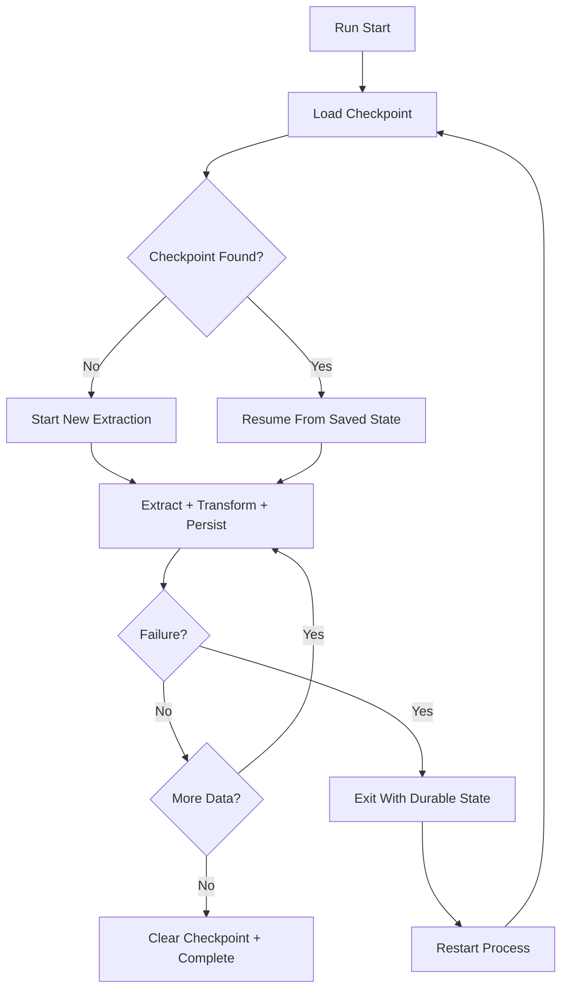

# Recovery System

## Operational Recovery Workflow

## Restart Lifecycle

1. Process initializes pipeline.
2. Checkpoint loader retrieves last continuation point.
3. Output file is reopened and existing rows are retained.
4. Extraction resumes from saved state token/page.
5. New progress checkpoints are persisted.
6. On successful completion, checkpoint is cleared.

## Interrupted Extraction Handling

The pipeline handles interruptions by coupling two durable operations per loop:

- output write
- checkpoint write

This ensures resume starts near the last durable output boundary, reducing replay surface.

## Transient Failure Handling

Retry-enabled session configuration addresses temporary failures:

- 429 rate-limit responses
- 500/502/503/504 server/transient responses

Behavior:

- retry with backoff
- fail fast for non-retryable errors (`raise_for_status`)
- preserve checkpoint for restart on unrecoverable exit

## Retry Behavior

| Category | Handling |
|---|---|
| 429 / 5xx | Automatic retries with backoff via `urllib3.Retry` |
| Network transport error | Session-level retry where eligible |
| Persistent invalid request/auth issue | Error raised, pipeline exits, checkpoint preserved |

## Pipeline Resiliency Model

Resiliency is achieved through:

- protocol-aware continuation state
- frequent durable progress commits
- shared transport retry controls
- stateless restart behavior from checkpoint files

## Recovery Runbook

1. Inspect logs for terminal error.
2. Confirm checkpoint file exists in `state/`.
3. Verify output file integrity in `output/`.
4. Restart pipeline process.
5. Confirm resume starts from checkpointed page/request id.
6. Confirm checkpoint file is removed on successful completion.
